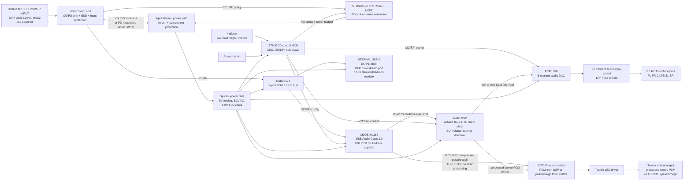

# USB-C 5.1 Audio Card with Dolby/DTS Passthrough Concept

This document captures a first-pass hardware architecture for a USB-C audio
card with real-time processing, 5.1 analog RCA/cinch outputs, optical Toslink
output, user EQ/volume controls, an internal USB-C expansion port, and a
single external USB-C port for both USB audio data and bus power.

## Key assumptions and constraints

- The external audio input USB-C port is a USB Audio Class 2.0 device port for a
  phone, tablet, PC, or console host.
- The card is bus-powered from the same external USB-C port that carries the
  audio data. There is no battery, no battery charger, and no separate charging
  port in this revision.
- Power budget is a primary design constraint. A basic USB 2.0/USB-C host
  may only provide 5 V at limited current; a USB-C source that advertises 1.5 A,
  3 A, or a USB PD contract gives more headroom for the audio DSP, DACs, op
  amps, Toslink, and the internal expansion port.
- The 5.1 analog output path is the primary multichannel output path.
- This revision intentionally does not include Dolby or DTS decode/encode
  hardware/software. It processes uncompressed PCM only, which avoids Dolby/DTS
  licensing for the product's own DSP path.
- Toslink/S/PDIF cannot carry uncompressed 5.1 PCM. It can carry stereo PCM or
  compressed surround bitstreams such as AC-3/Dolby Digital or DTS. Toslink is
  therefore limited to processed stereo PCM/downmix or passthrough of an
  already-compressed Dolby/DTS bitstream. The card cannot EQ/volume-process a
  passed-through compressed bitstream because it is not decoding it.
- The four front-panel sliders are read by an MCU ADC and applied in DSP as
  digital filter/gain controls. They are not placed directly in the analog
  audio path.

## Block diagram

Compressed passthrough means the card forwards the encoded S/PDIF payload
without decoding, EQ, volume, or bass-management changes.

## Signal and connection notes

### USB audio and expansion

- The external audio USB-C connector is wired as a USB 2.0 high-speed upstream
  device port and bus-power input:
  - D+/D- to the upstream pins of the USB2512B hub.
  - CC1/CC2 go to the selected USB-C/PD sink controller. If PD is omitted, use
    the standard 5.1 kOhm Rd pulldowns for a USB-C device/UFP and design for the
    advertised default/1.5 A/3 A Type-C current only.
  - VBUS feeds input protection, inrush limiting, and the system regulators.
  - Firmware should expose only the functions that fit the negotiated power
    budget. For example, reduce internal expansion-port power or disable high
    output-drive modes if the host only supplies default USB power.
- USB2512B downstream port 1 connects to the XMOS XU316 USB audio controller.
- USB2512B downstream port 2 connects to the internal USB-C expansion
  receptacle.
  - This lets a future add-on module enumerate to the same external USB host.
  - For a future Bluetooth audio receiver that must work without an external
    USB host, add a secondary expansion header carrying I2S/TDM, I2C, UART, 3.3V,
    and 5V to the DSP/MCU. A generic USB Bluetooth dongle requires a USB host
    stack and will not automatically feed audio into the card when the card is
    operating only as a USB peripheral.

### Audio processing

- XMOS XU316 handles the low-latency UAC2 endpoint and streams audio to the
  audio DSP over TDM/I2S.
- The audio DSP performs PCM-only processing:
  - Low, mid, high EQ from the three sliders using biquad filters.
  - Master volume from the volume slider.
  - Channel routing, optional downmix, mute, limiter, and bass-management logic.
- The audio DSP does not decode Dolby Digital, Dolby Digital Plus, DTS, or any
  other licensed compressed surround format.
- PCM1690 receives 6 or 8 channels of processed PCM over TDM/I2S and provides
  enough DAC channels for 5.1 plus two spare channels.
- DAC outputs should use low-noise differential-to-single-ended reconstruction
  filters before the RCA connectors. Use AC coupling or a proper output common
  mode/reference scheme based on the final analog rail design.

### Toslink modes

Recommended firmware modes:

1. **Processed stereo PCM optical output:** DSP applies EQ/volume/downmix and
   sends stereo PCM to Toslink.
2. **Dolby Digital / DTS passthrough:** pass an incoming AC-3, DTS, or other
   IEC61937-compatible S/PDIF payload to Toslink unchanged. EQ, volume, and bass
   management are bypassed because the payload remains compressed.
3. **Processed 5.1 optical output:** not included in this unlicensed revision.
   It would require decode, processing, and real-time re-encoding using licensed
   Dolby Digital Live or DTS Interactive/DTS Connect technology.

### Power from the audio USB-C port

- The card has no battery and no separate charging input. All rails are derived
  from the external audio/data USB-C port VBUS.
- With a simple USB-C source, expect 5 V input. With USB PD, the same connector
  may negotiate a higher-voltage sink contract, for example 9 V, 12 V, 15 V, or
  20 V. Higher VBUS reduces cable current but requires regulators and protection
  rated for the negotiated voltage.
- If the product must be compatible with ordinary PC USB-C ports, complete a
  worst-case power budget at 5 V before schematic capture. The internal USB-C
  expansion port should be power-limited or disabled when the upstream source
  cannot supply enough current.
- The power button is implemented as a soft-power input to the MCU. The MCU
  enables/disables downstream regulators and load switches in a safe sequence:
  analog muted, DAC reset/configured, DSP running, then outputs unmuted.

## Mouser-oriented preliminary BOM

Availability was checked against Mouser catalog/search results where possible
on 2026-06-22. Stock changes quickly, so re-check live Mouser inventory before
purchase and before PCB release.

| Area | Qty | Manufacturer part | Mouser part / search key | Purpose and notes |
| --- | ---: | --- | --- | --- |
| USB-C connectors | 2 | Amphenol ICC 12401610E4#2A | 523-12401610E4#2A | External audio/data/power USB-C receptacle and internal expansion USB-C receptacle. USB 3.x-capable connector used even though this design only requires USB 2.0 data. |
| USB hub | 1 | Microchip USB2512B-I/M2 | 579-USB2512B-I/M2 | Two-port USB 2.0 high-speed hub. Downstream ports go to XMOS and internal expansion connector. |
| USB audio controller | 1 | XMOS XU316-1024-TQ128-C24 | 1069-3161024TQ128C24 | UAC2 multichannel audio bridge. XMOS reference software supports multichannel USB audio, S/PDIF, MIDI, and TDM/I2S-style audio routing. |
| USB ESD protection | 2-3 | ST USBLC6-2SC6 | 511-USBLC6-2SC6 | Low-capacitance USB 2.0 data-line protection for USB-C D+/D- pairs. Use one per exposed USB port and as needed near internal connector. |
| PCM audio DSP | 1 | Analog Devices ADAU1467WBCPZ300 or ADAU1452WBCPZ | 584-ADAU1467WBCPZ300 / search Mouser for ADAU1452WBCPZ | Lower-cost SigmaDSP-class processor for EQ, volume, routing, downmix, and bass management on PCM. No Dolby/DTS decode or encode. |
| Boot/config flash | 2 | Winbond W25Q64JVSSIQ or W25Q128JVSIQ | Search Mouser for W25Q64JVSSIQ / W25Q128JVSIQ | QSPI/SPI flash for XMOS and DSP firmware as required by final boot architecture. |
| Multichannel DAC | 1 | Texas Instruments PCM1690DCA | 595-PCM1690DCA | 8-channel, 24-bit, 192 kHz DAC with TDM/I2S support. Use 6 channels for 5.1; keep 2 channels spare. |
| Audio op amps | 6-8 | Texas Instruments OPA1678IDR | 595-OPA1678IDR | Low-noise dual audio op amps for DAC reconstruction filters and RCA line drivers. Final count depends on filter topology. |
| RCA/cinch outputs | 1 or 6 | Same Sky RCJ-61232323 or individual RCA jacks | Search Mouser for RCJ-61232323 / RCA phono connectors | Six analog outputs. A 2x3 stack saves panel area; individual jacks allow standard 5.1 color coding. |
| S/PDIF source select | 1 | SN74LVC1G3157DBVR or equivalent 2:1 digital switch/mux | Search Mouser for SN74LVC1G3157DBVR | Selects processed stereo PCM S/PDIF from the DSP or compressed AC-3/DTS passthrough from XMOS for the Toslink transmitter. |
| Toslink transmitter | 1 | Toshiba TOTX1350(F) | 757-TOTX1350F | Optical S/PDIF transmitter module. Requires LED drive circuit. |
| Toslink driver logic | 1 | SN74LVC1T45DBVR or SN74LVC1G04DBVR | Search Mouser for SN74LVC1T45DBVR / SN74LVC1G04DBVR | Level/edge conditioning from the selected S/PDIF source to the Toslink LED driver. Choose based on I/O voltage and polarity. |
| Control MCU | 1 | ST STM32G071RBT6 or STM32G0B1KET6N | Search Mouser for STM32G071RBT6 / STM32G0B1KET6N | Reads four sliders and button; controls DSP/DAC/XMOS/hub/S/PDIF mux/PD status over I2C/SPI/GPIO. STM32G0 parts also provide USB-C/PD-capable variants if desired. |
| EQ/volume sliders | 4 | Bourns PTA3043-2010CPB103 or PTA/PTB 10 kOhm linear equivalent | Search Mouser for PTA3043 10K linear slide potentiometer | Low, mid, high, and volume controls. Wire as 3.3 V ADC dividers with RC filtering; use linear taper because DSP maps the response curve. |
| Power button | 1 | E-Switch TL3305AF160QG or equivalent momentary tact switch | Search Mouser for TL3305AF160QG | Soft on/off input to MCU or power latch circuit. |
| USB-C PD sink | 1 | STMicroelectronics STUSB4500QTR | 511-STUSB4500QTR | Optional but recommended PD sink controller on the same external USB-C audio/data connector. Configure PDOs for the desired bus-power voltage/current. If omitted, design for USB-C default/advertised current at 5 V. |
| Main buck regulator | 1-2 | Texas Instruments LMR33630ADDAR or TPS62130RGTR | Search Mouser for LMR33630ADDAR / 595-TPS62130RGTR | Generate 5 V and/or 3.3 V system rails from USB-C VBUS. Use LMR33630 for higher PD input voltage rails; use TPS62130 for compact 3 A point-of-load rails after a 5 V input rail. |
| Low-noise analog LDO | 1-2 | Texas Instruments TPS7A4700RGWR | 595-TPS7A4700RGWR | Clean post-regulated analog rail for DAC/op amp supplies where dropout and thermal budget allow. |
| Load switch | 2-4 | Texas Instruments TPS22965DSGR | 595-TPS22965DSGR | Soft-power sequencing and switched rails for USB expansion, analog output, or digital subsystems. |
| Audio clocks | 2 | 22.5792 MHz and 24.576 MHz low-jitter oscillators | Search Mouser for Abracon/NDK/Crystek audio oscillators | Support both 44.1 kHz and 48 kHz sample-rate families unless final firmware uses ASRC-only clocking. |
| Passives/protection | As needed | 1% resistors, X7R capacitors, ferrites, common-mode chokes, input fuses | Mouser stocked commodity parts | Include USB-C CC/PD support parts, VBUS fuse/eFuse/TVS, LC filters, DAC reference parts, analog coupling caps, and EMI parts. |

## Open engineering items before schematic capture

1. Decide which USB audio descriptors/endpoints are needed for both multichannel
   PCM playback and encoded IEC61937 passthrough. Passthrough support is mostly
   a USB firmware/driver compatibility task, not a Dolby/DTS decoder task.
2. Decide whether the host-facing UI should expose separate modes for "5.1 PCM
   analog output", "stereo PCM Toslink", and "encoded passthrough Toslink" to
   avoid sending compressed data into the PCM DSP path.
3. Complete a bus-power budget for 5 V default USB-C, 5 V at 1.5 A/3 A, and any
   desired USB PD profiles before locking regulators, expansion-port current,
   and analog output headroom.
4. Decide whether the internal USB-C expansion port is host-visible only through
   the external USB connection or whether add-on modules also need direct I2S
   access to the DSP for standalone Bluetooth audio.
5. Prototype with XMOS and ADI evaluation boards before the custom PCB to verify
   UAC2 channel mapping, compressed bitstream handling, latency, and DSP load.
