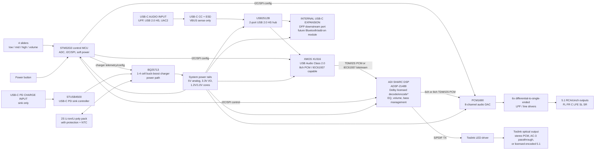

# USB-C Dolby Digital 5.1 Audio Card Concept

This document captures a first-pass hardware architecture for a USB-C audio
card with real-time processing, 5.1 analog RCA/cinch outputs, optical Toslink
output, user EQ/volume controls, an internal USB-C expansion port, and a
separate USB-C Power Delivery charging port.

## Key assumptions and constraints

- The external audio input USB-C port is a USB Audio Class 2.0 device port for a
  phone, tablet, PC, or console host.
- The 5.1 analog output path is the primary multichannel output path.
- Dolby Digital decoding or encoding cannot be implemented legally by only
  buying a DSP IC. Dolby technologies require a Dolby license, licensed
  decoder/encoder object code, and product certification. The hardware below
  is sized for that path, but the Dolby license and software deliverables are
  separate commercial items.
- Toslink/S/PDIF cannot carry uncompressed 5.1 PCM. It can carry stereo PCM or
  compressed surround bitstreams such as AC-3/Dolby Digital. If the product
  must output processed 5.1 over Toslink, it needs a licensed real-time Dolby
  Digital encoder, often marketed as Dolby Digital Live. Without that encoder,
  Toslink should be limited to processed stereo PCM/downmix or passthrough of
  an already-compressed Dolby Digital bitstream.
- The four front-panel sliders are read by an MCU ADC and applied in DSP as
  digital filter/gain controls. They are not placed directly in the analog
  audio path.

## Block diagram

`*` Dolby decode/encode capability depends on the exact licensed software bundle
and certification, not only on the selected DSP silicon.

## Signal and connection notes

### USB audio and expansion

- The external audio USB-C connector is wired as a USB 2.0 high-speed upstream
  device port:
  - D+/D- to the upstream pins of the USB2512B hub.
  - CC1/CC2 each use 5.1 kOhm Rd pulldowns for a USB-C device/UFP.
  - VBUS is sensed for attach detection but the board is self-powered from the
    battery/charger power tree.
- USB2512B downstream port 1 connects to the XMOS XU316 USB audio controller.
- USB2512B downstream port 2 connects to the internal USB-C expansion
  receptacle.
  - This lets a future add-on module enumerate to the same external USB host.
  - For a future Bluetooth audio receiver that must work without an external
    USB host, add a secondary expansion header carrying I2S/TDM, I2C, UART, 3.3V,
    and 5V to the DSP/MCU. A generic USB Bluetooth dongle requires a USB host
    stack and will not automatically feed audio into the card when the card is
    operating only as a USB peripheral.

### Audio processing

- XMOS XU316 handles the low-latency UAC2 endpoint and streams audio to the
  SHARC DSP over TDM/I2S.
- The SHARC DSP performs:
  - Dolby Digital decode when provided with licensed Dolby/ADI software and a
    valid compressed bitstream.
  - Low, mid, high EQ from the three sliders using biquad filters.
  - Master volume from the volume slider.
  - Channel routing, optional downmix, mute, limiter, and bass-management logic.
- PCM1690 receives 6 or 8 channels of processed PCM over TDM/I2S and provides
  enough DAC channels for 5.1 plus two spare channels.
- DAC outputs should use low-noise differential-to-single-ended reconstruction
  filters before the RCA connectors. Use AC coupling or a proper output common
  mode/reference scheme based on the final analog rail design.

### Toslink modes

Recommended firmware modes:

1. **Stereo PCM optical output:** processed stereo/downmix; no Dolby encoder
   required.
2. **Dolby Digital passthrough:** pass an incoming AC-3/IEC61937 bitstream to
   Toslink; EQ/volume processing generally cannot be applied because the stream
   remains compressed.
3. **Processed 5.1 optical output:** decode, process, then re-encode as Dolby
   Digital. This requires a licensed real-time Dolby Digital encoder and
   certification.

### Power and charging

- The charge USB-C port is independent of the audio USB-C port.
- STUSB4500 negotiates a USB-C PD sink contract, for example 9 V, 12 V, 15 V, or
  20 V depending on charger capability and thermal design.
- BQ25713 handles battery charging and system power path for a 1S to 4S pack.
  A 2S protected Li-ion/Li-poly pack is a practical starting point because it
  keeps analog headroom and buck conversion efficient.
- The power button is implemented as a soft-power input to the MCU. The MCU
  enables/disables downstream regulators and load switches in a safe sequence:
  analog muted, DAC reset/configured, DSP running, then outputs unmuted.

## Mouser-oriented preliminary BOM

Availability was checked against Mouser catalog/search results where possible
on 2026-06-22. Stock changes quickly, so re-check live Mouser inventory before
purchase and before PCB release.

| Area | Qty | Manufacturer part | Mouser part / search key | Purpose and notes |
| --- | ---: | --- | --- | --- |
| USB-C connectors | 3 | Amphenol ICC 12401610E4#2A | 523-12401610E4#2A | External audio USB-C, internal expansion USB-C, and charging USB-C receptacles. USB 3.x-capable connector used even though this design only requires USB 2.0 data. |
| USB hub | 1 | Microchip USB2512B-I/M2 | 579-USB2512B-I/M2 | Two-port USB 2.0 high-speed hub. Downstream ports go to XMOS and internal expansion connector. |
| USB audio controller | 1 | XMOS XU316-1024-TQ128-C24 | 1069-3161024TQ128C24 | UAC2 multichannel audio bridge. XMOS reference software supports multichannel USB audio, S/PDIF, MIDI, and TDM/I2S-style audio routing. |
| USB ESD protection | 3-4 | ST USBLC6-2SC6 | 511-USBLC6-2SC6 | Low-capacitance USB 2.0 data-line protection for USB-C D+/D- pairs. Use one per exposed USB port and as needed near internal connector. |
| Main audio DSP | 1 | Analog Devices ADSP-21489KSWZ-4A | 584-ADSP21489KSWZ-4A | SHARC DSP for licensed Dolby decode/encode path, EQ, volume, routing, and S/PDIF. Confirm exact Dolby software and certification before final design. |
| Optional newer DSP alternative | 1 | Analog Devices ADSP-21569 family | Search Mouser for ADSP-21569 | Higher-performance SHARC+ option for newer Dolby stacks; package and supply complexity are higher, and inventory should be verified. |
| Boot/config flash | 2 | Winbond W25Q64JVSSIQ or W25Q128JVSIQ | Search Mouser for W25Q64JVSSIQ / W25Q128JVSIQ | QSPI/SPI flash for XMOS and DSP firmware as required by final boot architecture. |
| Multichannel DAC | 1 | Texas Instruments PCM1690DCA | 595-PCM1690DCA | 8-channel, 24-bit, 192 kHz DAC with TDM/I2S support. Use 6 channels for 5.1; keep 2 channels spare. |
| Audio op amps | 6-8 | Texas Instruments OPA1678IDR | 595-OPA1678IDR | Low-noise dual audio op amps for DAC reconstruction filters and RCA line drivers. Final count depends on filter topology. |
| RCA/cinch outputs | 1 or 6 | Same Sky RCJ-61232323 or individual RCA jacks | Search Mouser for RCJ-61232323 / RCA phono connectors | Six analog outputs. A 2x3 stack saves panel area; individual jacks allow standard 5.1 color coding. |
| Toslink transmitter | 1 | Toshiba TOTX1350(F) | 757-TOTX1350F | Optical S/PDIF transmitter module. Requires LED drive circuit. |
| Toslink driver logic | 1 | SN74LVC1T45DBVR or SN74LVC1G04DBVR | Search Mouser for SN74LVC1T45DBVR / SN74LVC1G04DBVR | Level/edge conditioning from DSP S/PDIF output to Toslink LED driver. Choose based on DSP I/O voltage and polarity. |
| Control MCU | 1 | ST STM32G071RBT6 or STM32G0B1KET6N | Search Mouser for STM32G071RBT6 / STM32G0B1KET6N | Reads four sliders and button; controls DSP/DAC/XMOS/hub/charger over I2C/SPI/GPIO. STM32G0 parts also provide USB-C/PD-capable variants if desired. |
| EQ/volume sliders | 4 | Bourns PTA3043-2010CPB103 or PTA/PTB 10 kOhm linear equivalent | Search Mouser for PTA3043 10K linear slide potentiometer | Low, mid, high, and volume controls. Wire as 3.3 V ADC dividers with RC filtering; use linear taper because DSP maps the response curve. |
| Power button | 1 | E-Switch TL3305AF160QG or equivalent momentary tact switch | Search Mouser for TL3305AF160QG | Soft on/off input to MCU or power latch circuit. |
| USB-C PD sink | 1 | STMicroelectronics STUSB4500QTR | 511-STUSB4500QTR | Standalone PD sink controller for the charging USB-C port. Configure PDOs for the desired charger voltage/current. |
| Battery charger / power path | 1 | Texas Instruments BQ25713RSNR | 595-BQ25713RSNR | 1S-4S NVDC buck-boost charger controller with USB-C/PD input support. Requires external MOSFETs, inductor, current sense, and layout care. |
| Main buck regulator | 1-2 | Texas Instruments LMR33630ADDAR or TPS62130RGTR | Search Mouser for LMR33630ADDAR / 595-TPS62130RGTR | Generate 5 V and/or 3.3 V system rails from battery/system voltage. Use LMR33630 for higher input voltage rails; use TPS62130 for compact 3 A point-of-load rails. |
| Low-noise analog LDO | 1-2 | Texas Instruments TPS7A4700RGWR | 595-TPS7A4700RGWR | Clean post-regulated analog rail for DAC/op amp supplies where dropout and thermal budget allow. |
| Load switch | 2-4 | Texas Instruments TPS22965DSGR | 595-TPS22965DSGR | Soft-power sequencing and switched rails for USB expansion, analog output, or digital subsystems. |
| Battery pack | 1 | 2S protected Li-ion/Li-poly pack with NTC | Select certified pack/vendor | Select capacity, protection, safety certification, and connector after mechanical/thermal design. Mouser carries battery-related parts, but the final pack should be sourced as a certified assembly. |
| Audio clocks | 2 | 22.5792 MHz and 24.576 MHz low-jitter oscillators | Search Mouser for Abracon/NDK/Crystek audio oscillators | Support both 44.1 kHz and 48 kHz sample-rate families unless final firmware uses ASRC-only clocking. |
| Passives/protection | As needed | 1% resistors, X7R capacitors, ferrites, common-mode chokes, input fuses | Mouser stocked commodity parts | Include USB-C CC resistors, PD input fuse/TVS, LC filters, DAC reference parts, analog coupling caps, and EMI parts. |

## Open engineering items before schematic capture

1. Decide whether Toslink must output processed 5.1. If yes, budget and license
   for a Dolby Digital real-time encoder; otherwise implement stereo PCM/downmix
   and/or AC-3 passthrough.
2. Confirm the exact Dolby decode/encode software package and certified target
   processor with Dolby/ADI before locking the DSP part number.
3. Choose the battery configuration and enclosure first enough to complete
   charging current, thermal, safety, and certification analysis.
4. Decide whether the internal USB-C expansion port is host-visible only through
   the external USB connection or whether add-on modules also need direct I2S
   access to the DSP for standalone Bluetooth audio.
5. Prototype with XMOS and ADI evaluation boards before the custom PCB to verify
   UAC2 channel mapping, compressed bitstream handling, latency, and DSP load.
